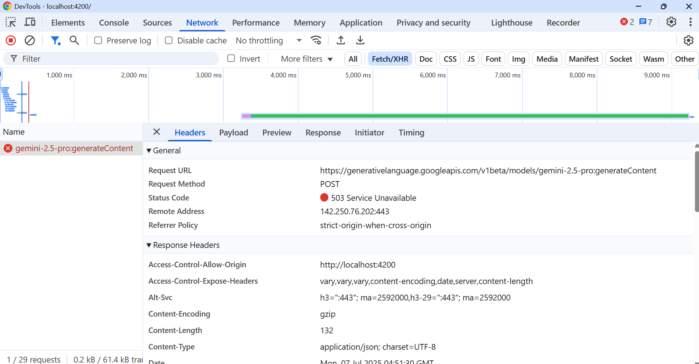
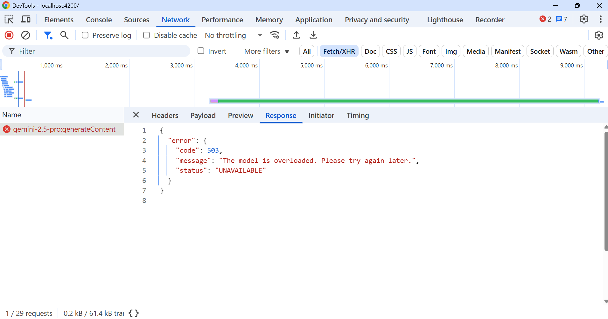

# Angular Apps with Google Gemini AI
Gemini is a multimodal AI model that can understand and generate text, as well as other types of information like audio, images, videos, and code. Gemini is Google's most capable AI model, and is the first to outperform human experts on MMLU (Massive Multitask Language).

# Types of Gemini Models

**Flash** 
-----------------------------------------------------------------------------------------------------
Flash is all about speed. Think of Usain Bolt, the fastest man ever. This is flash. Flash is built for tasks that need quick responses. Real time interaction and lightning fast results. Say, for example, you're working on something that needs instant feedback like customers, live chat, fast summarization, or troubleshooting an urgent problem. 
Flash is the one to call.
Our best model in terms of price-performance, offering well-rounded capabilities.
  -   Input audio, images, video, and text, and get text responses
  -   Model thinks as needed; or, you can configure a thinking budget
  -   Best for low latency, high volume tasks that require thinking

**Pro**  
-----------------------------------------------------------------------------------------------------
Pro is the powerhouse of the family. Pro is the marathon runner. It's made for those bigger, more complex tasks. Stuff like, uh, detailed research, analyzing big chunks of data, solving complex mathematical problems, going through the stock market graphs and then analyzing them. You name it, whatever thing that comes complex in the mind. This is for the pro.
Our most powerful thinking model with maximum response accuracy and state-of-the-art performance.
  -  Input audio, images, video, and text, get text responses
  -  Tackle difficult problems, analyze large databases, and more
  -  Best for complex coding, reasoning, and multimodal understanding

**Flash Light**  
-----------------------------------------------------------------------------------------------------
Then comes the flash thinking this is the strategist of the family. This model isn't just fast or powerful. It's smart. It can analyze reasons and even predict outcomes based on the information you give it. Let's say, for example, you are planning a business or brainstorming for a travel trip. Thinking. doesn't just give you answers. It connects the dots. It helps you strategize. Gets your old data and preferences and uses them as a reference to make decisions that feel thoughtful. It also gives you a backlog of how it thoughts about it, so you know exactly how it landed and how it ended with the responses it gave you. Flush thinking is having a friend with a very high IQ who thinks with you, and over time he understands you.
A Flash light model optimized for cost efficiency and low latency.
  -   Input audio, images, video, and text, and get text responses
  -   Most cost-efficient model supporting high throughput
  -   Best for real time, low latency use cases

## Gemini Models
https://ai.google.dev/gemini-api/docs/models

## Gemini vs ChatGPT
**ChatGPT**  
-----------------------------------------------------------------------------------------------------
ChatGPT has been a game changer in the world of conversational AI. 
  -  Multimodal Capabilities : It's smart, it's polished, and it's becoming a multi-modal as well, meaning it can handle text, images, and even some audio. For instance, you can upload a picture to ChatGPT and ask it to describe it for you.
  -  Creative Powerhouse : Excels in creative writing and image description.
  -  Static Input Focus : But it's focused on static input only, which means it's great for working with things like documents or images, but it's not really built for interacting with you in real time, or interacting with software or hardware.

You could upload a product idea and ask for some creative suggestions. It will give you great options.

For instance, as an example, no matter the versions of ChatGPT, you cannot share your. Screen with ChatGPT and ask it to guide you in a task or share your camera and ask it. 
To see things in your environment. It doesn't understand context and so at a certain point. It just becomes a mess.


**Gemini**  
-----------------------------------------------------------------------------------------------------
But Gemini is designed to take to take things a little bit further. It's not just multimodal, it's interactive. And that's through text, images, video, audio. Software and even hardware.

Gemini doesn't just process information, it works with the information you give it in real time. For example, let's say with Gemini, you are troubleshooting Routine, something on your desk. You just share your camera in real time with. Gemini and start talking with your voice. Gemini will analyze your environment. Point out what's wrong and tell you exactly how to fix it.

Or You share your screen while working on a project that your manager gave you. It will see exactly what you're doing. It will watch exactly what you are. Working on and guide you with the exact steps on your screen. And I'll show you everything of how it's being done. Because this is revolutionary.

And that's not all. Gemini's thinking model adds a layer of intelligence. That's different from what ChatGPT offers. It doesn't just respond or refer. To the information from the training model. It thinks like a human. And that's very powerful when it comes to the AI.

Also scary. But I will show you how to take the best out of it as we go. So imagine brainstorming. You're brainstorming a new product idea. The thinking model not only connects the dots from your inputs, but also uses past data preferences patterns it learned from previous companies and starts getting things all together to give you a strategic response. And it also gives you a backlog of how it it it came up to that conclusion. So it gives you a clear level of transparency. That's pretty rare in AI.
And we'll use it in action. So you see exactly what I'm talking about.

You could share a video of your prototype, ask Gemini to analyze customer feedback data. Give a bunch of statistical data about your customers or your competitors or whatever, and ask it to think about it and provide the patterns that it discussed that it that it came up to. You can interact with it in real time with Project Astra that I will show you later on as we go in the course. You can have AI do things for you literally as AI agents all in one place.

And that's the difference between ChatGPT and Gemini.

Gemini is having a hands on assistant who's not just thinking with you. It's working with you in real time, and it changes the whole equation. Either we're talking about work, personal life, projects, business, you name it.

## Gemini Model Error
https://generativelanguage.googleapis.com/v1beta/models/gemini-2.5-pro:generateContent (POST) - 503 error
```
{
  "error": {
    "code": 503,
    "message": "The model is overloaded. Please try again later.",
    "status": "UNAVAILABLE"
  }
}
```



##  How to Generate a Google Gemini API Key: Step-by-Step Guide
Sign up for a Google Cloud developer account. Access Google AI Studio and generate a new API key. This key is essential for authenticating requests to the Gemini API.  
https://aistudio.google.com/app/apikey  
https://www.youtube.com/watch?v=o8iyrtQyrZM  

## Install the Google Generative AI SDK:
In your Angular project, install the official Google Generative AI SDK using npm:
Code
```
npm install @google/generative-ai
```
## +50 Image & Video generation Ideas with Gemini
[+50 Image & Video generation Ideas with Gemini](https://github.com/piyalidas10/Angular-Apps-with-Google-Gemini-AI/blob/3bf05003686bebfb8324e0435a5a2b4c2eadca8f/tutorials/%2B50%20Image%20%26%20Video%20generation%20Ideas%20with%20Gemini.pdf)
