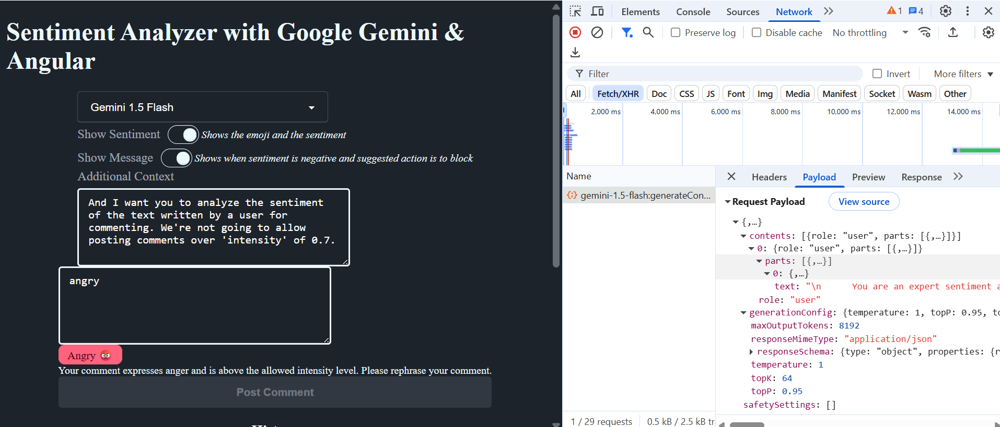
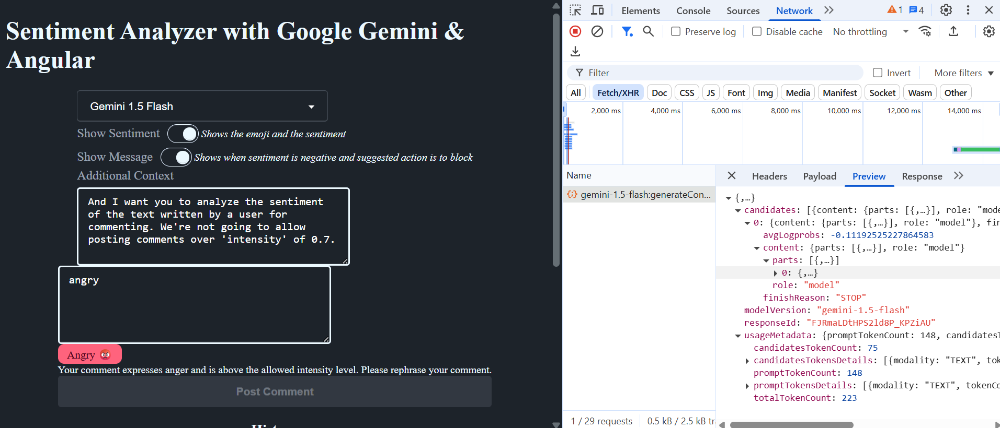
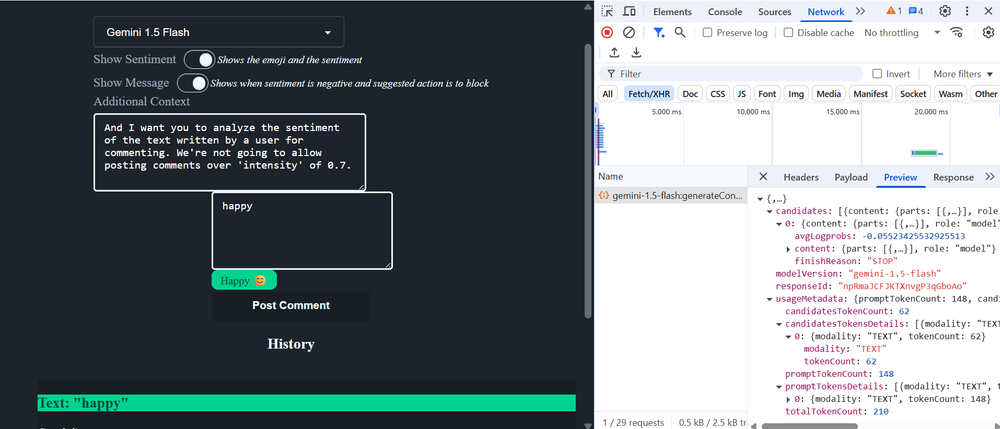

# Sentiment Analyzer using Google Gemini API (Gemini 1.5 Pro & Gemini 1.5 Flash)
https://aistudio.google.com/prompts/new_chat
https://ai.google.dev/gemini-api/docs
https://ai.google.dev/gemini-api/docs/models

The Gemini API key is free to obtain and use for testing and development purposes. You can get your API key by creating a free account on Google AI Studio and following the instructions to generate it. While there is a free tier with rate limits for testing, higher rate limits and more features are available in a paid tier. 

# How to Generate a Google Gemini API Key: Step-by-Step Guide
https://www.youtube.com/watch?v=o8iyrtQyrZM

# Integrating Gemini AI into an Angular 19 application involves several key steps to leverage its generative AI capabilities.
https://github.com/AhsanAyaz/ng-gc-ws/blob/main/libs/ng-gc/src/lib/services/gemini.service.ts
https://www.youtube.com/watch?v=IFt3XjWkpMk
https://www.youtube.com/watch?v=QKnhgsaQGyM

## Obtain a Gemini API Key:
Sign up for a Google Cloud developer account.
Access Google AI Studio and generate a new API key. This key is essential for authenticating requests to the Gemini API.

## Install the Google Generative AI SDK:
In your Angular project, install the official Google Generative AI SDK using npm:
Code

     npm install @google/generative-ai

## Create an Angular Service for Gemini API Interaction:
Generate a new service using the Angular CLI:
Code

     ng generate service gemini

In this service, import the GoogleGenerativeAI client and initialize it with your API key.
Implement methods within the service to handle different Gemini functionalities, such as:
Text generation: Sending text prompts to the model and receiving text responses.
Multimodal input: Sending text and image inputs for multimodal content generation.
Chat functionality: Managing multi-turn conversations with the Gemini model.
Streaming responses: Handling real-time streaming of AI-generated content.

## Integrate the Gemini Service into Angular Components:
Inject the GeminiService into your Angular components where you need to interact with the AI.
Call the appropriate methods from the GeminiService based on user interactions (e.g., submitting a chat message, uploading an image).
Display the AI-generated responses within your component's template, potentially using Angular's reactive programming features for real-time updates.

## Enhance User Experience:
Design a user-friendly interface for interacting with the AI, including input fields, chat bubbles, and potentially features like predefined questions or personality selection options.
Implement loading indicators or animations to provide feedback during AI processing.
Example of Service Initialization:
TypeScript

// src/app/gemini.service.ts
import { Injectable } from '@angular/core';
import { GoogleGenerativeAI } from '@google/generative-ai';
import { environment } from '../environments/environment'; // Assuming you store API key in environment

@Injectable({
  providedIn: 'root'
})
export class GeminiService {
  private genAI: GoogleGenerativeAI;
  private model: any; // Or specify a more precise type if available

  /*
  Initialise your model
  -----------------------------------------------------------------------------------------------
  Before calling Gemini we need to go through the model initialisation. This includes the following steps:

  1. Initialising GoogleGenerativeAI client with your API key.
  2. Choosing a Gemini model: gemini-pro or gemini-pro-vision.
  3. Setting up model parameters including safetySettings, temperature, top_p, top_k and maxOutputTokens.
  */
  constructor() {
    const generationConfig = {
      safetySettings: [
        {
          category: HarmCategory.HARM_CATEGORY_HARASSMENT,
          threshold: HarmBlockThreshold.BLOCK_LOW_AND_ABOVE,
        },
      ],
      temperature: 0.9,
      top_p: 1,
      top_k: 32,
      maxOutputTokens: 100, // limit output
    };
    this.genAI = new GoogleGenerativeAI(environment.googleAiApiKey);
    this.model = this.genAI.getGenerativeModel({ model: 'gemini-pro' , ...generationConfig}); // Or 'gemini-pro-vision' for multimodal
  }

  async generateText(prompt: string): Promise<string> {
    const result = await this.model.generateContent(prompt);
    const response = await result.response;
    return response.text();
  }

  // Add methods for chat, multimodal input, etc.
}

# daisy ui tailwind in angular 19
Integrating daisyUI and Tailwind CSS in an Angular 19 project involves several steps to set up the styling framework and the component library.
Create an Angular Project: If an Angular project does not exist, create one using the Angular CLI:
Code

    ng new my-angular-project --style css

> cd my-angular-project
Install Tailwind CSS and daisyUI: Install both Tailwind CSS and daisyUI, along with PostCSS, which is a dependency for Tailwind CSS in Angular:
Code

    npm install -D tailwindcss daisyui postcss @tailwindcss/postcss

> Configure PostCSS: Create a .postcssrc.json file at the root of the project and add the Tailwind CSS plugin:
Code

    {
      "plugins": {
        "@tailwindcss/postcss": {}
      }
    }

> Configure Tailwind CSS: Generate the tailwind.config.js file and configure the template paths to ensure Tailwind CSS scans the necessary files for classes:
Code

    npx tailwindcss init

> Then, modify tailwind.config.js to include the daisyUI plugin and specify content paths:
JavaScript

    /** @type {import('tailwindcss').Config} */
    module.exports = {
      content: [
        "./src/**/*.{html,ts}",
      ],
      theme: {
        extend: {},
      },
      plugins: [require("daisyui")],
    };
    
> Import Styles: Add the Tailwind CSS directives and the daisyUI plugin import to your global stylesheet (e.g., src/styles.css):
Code

    @tailwind base;
    @tailwind components;
    @tailwind utilities;
    @import "daisyui";
Start the Development Server: Run the Angular application to verify the setup:
Code

    ng serve
After these steps, daisyUI component classes and Tailwind CSS utility classes can be used directly in Angular templates.
